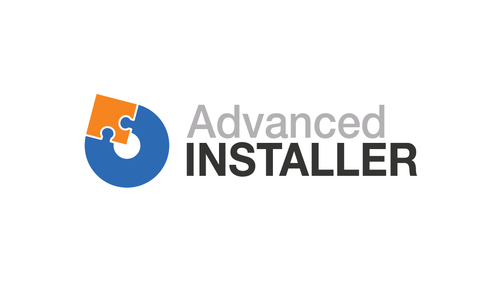

# DeploymentToolkit - Installer

Installer project used for distribution of all the deployment toolkit components.

This installer has been made possible with the help of [Advanced Installer](<https://www.advancedinstaller.com/>). They provided us with a free professional license for usage with this project. 

## What is Advanced Installer?

Advanced Installer is a MSI authoring and repackaging software, user by developers and IT professionals around the world.

## Open Source license

Apply for your own open source license [here](https://www.advancedinstaller.com/free-license.html).